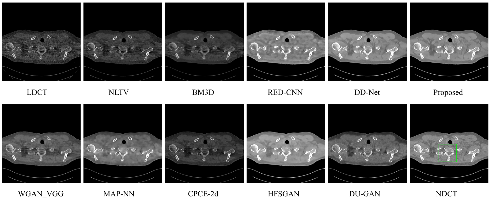
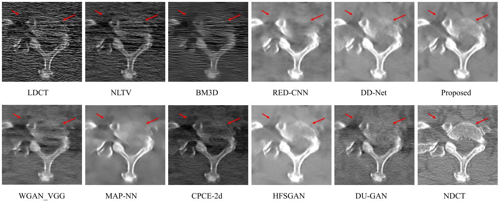

# Low-dose CT Image Denoising Based on Improved DD-Net and Local Filtered Mechanism
This repository contains the PyTorch implementation of the paper: **Low-dose CT Image Denoising Based on Improved DD-Net and Local Filtered Mechanism**.
## Illustration






## DATASETS 
In our experiments, the datasets come from the “2016 NIH-AAPM Mayo Clinic Low Dose CT
Grand Challenge”. The medical image datasets can be obtained from the Cancer Imaging Archive (TCIA) web site at
https://wiki.cancerimagingarchive.net/pages/viewpage.action?pageId=52758026.

## Training
Here we provide DD-Net, DD-Net+VGG and our model implementation. 
Run the following code to get our model.
```bash
# obtain the pre-trained model
python pretrained80.py  
# obtain our model with local filtered mechanism
python train.py
```
Run the following code to get DD-Net model. 
```bash
# obatin the DD-Net model
python train_ddnet.py
```
Download the VGG19 model at [BaiduNetDisk](https://pan.baidu.com/s/1jjub3R3BGAtVO7kp4UYk0Q) password: q06d and 
put it into directory "pths/". Run the following code to get DD-Net+VGG model. 
```bash
# obatin the DD-Net+VGG model
python train_ddnet_vgg.py
```
Before you train the model, please change the training and testing datasets paths to your own paths in corresponding 
python script. The default parameters can be run on single 2080Ti GPU.
## Testing
>We provide the testing code for DD-Net and our model. Before you test the model, please change the testing dataset
path to your own path in corresponding python script.
Make directory "Local Filtered Mechanism" as source root in the Pycharm, run "test.py" in the directory "models/DD_Net
" to test DD-Net model, and run "test.py" in the directory "/models/OurModel" to test our 
model.
## Generating Denoised Images
> We provide the demo code for DD-Net and our model. Before you run demo code, please change input
> directory of LDCT images. Run "demo.py" in the directory "/models/DD_Net" to generate the denoised images based on 
> DD-Net. Run "demo.py" in the directory "/model/OurModel" to generate the denoised images based on our model.

The models in our experiment can be download at [BaiduNetDisk](https://pan.baidu.com/s/1BjMUW2rPfsfw0NtuKKo_GA)
password: 5nq9. Please put it into directory "pths". Run the code to generate denoised images.
## Visualization

> We provide the code to adjust CT window for better visualization. Run "visualize.py" in the directory "/fig" to adjust CT window.
> Before you visualize the denoised results. Please set the display window range to your own window range.

## Requirements
```
torch=1.8.1+cu101
torchvision=0.9.1+cu101
opencv-python=4.5.4.60 
pillow=8.4.0 
matplotlib=3.3.4
pydicom=2.3.0 
pytorch-ssim=0.1
pytorch-msssim=0.2.1 
scikit-image= 0.17.2
scikit-learn=0.24.2
scipy=1.5.3  
```